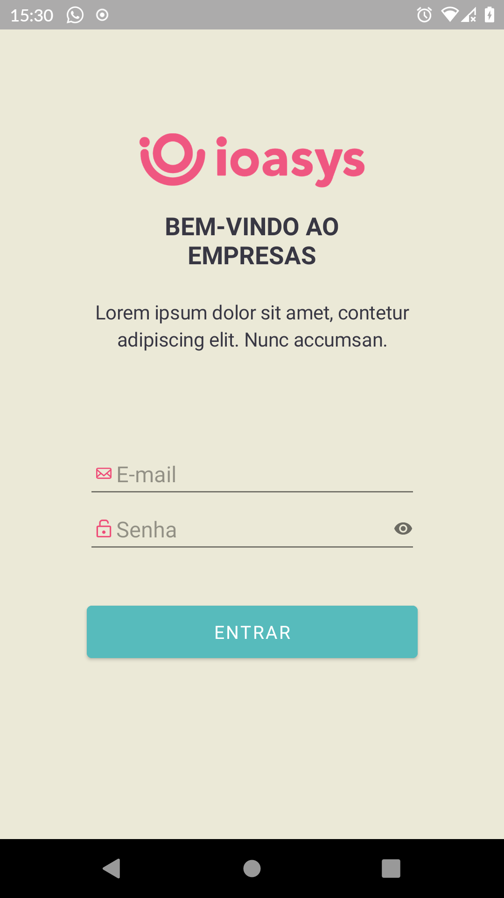

# PROJETO EMPRESAS #

Esse app é uma ilustração funcional, que utiliza o padrão de autenticação Oauth 2.0 
para poder acessar uma lista de empresas ficticias. 

* Kotlin
* Architecture Component
* MVVM Pattern

### BIBLIOTECAS ###

* Retrofit2
* Glide
* GSON
* Hilt
* LiveData
* ViewModel

### COMO EXECUTAR O PROJETO ###

A forma mais simples de executar o projeto é utilizando a ide Android Studio V-4.2.1.
Android Studio -> Janela principal -> Get From Version Control 
-> URL: https://github.com/hillanvieira/Empresas.git -> Clone.

Ou abra um terminal digite o comando: 
git clone https://github.com/hillanvieira/Empresas.git
na pasta que deseja clonar o projeto e no Android Studio -> Open an Existing Project -> Selecione o caminho :).

